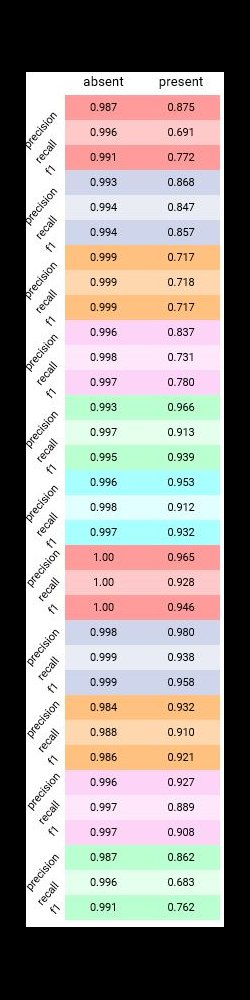
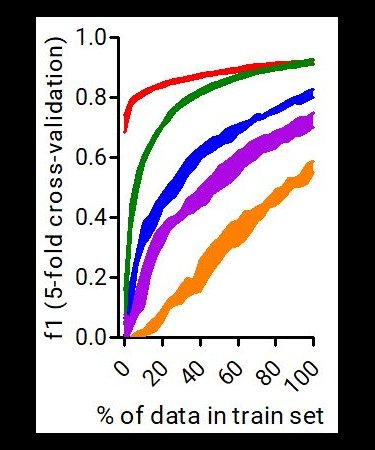
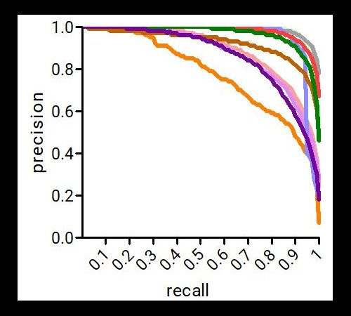
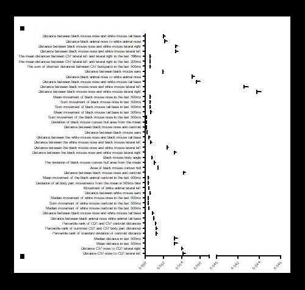

### some back-end scripts for SimBA
##### Check [SimBA repo](https://github.com/sgoldenlab/simba) for documentation. 
* Generates learning curves, precision-recall curves, precision/recall/f1 curves. 
* Performs [random undersampling](https://imbalanced-learn.readthedocs.io/en/stable/generated/imblearn.under_sampling.RandomUnderSampler.html) / [SMOTE](https://imbalanced-learn.readthedocs.io/en/stable/generated/imblearn.over_sampling.SMOTE.html) / [SMOTEENN](https://imbalanced-learn.readthedocs.io/en/stable/generated/imblearn.combine.SMOTEENN.html)
* [Corrects outliers](https://github.com/sgoldenlab/simba/blob/master/misc/Outlier_settings.pdf) based on user-defined criteria. 
* Calculates [gini impurity importance's](https://scikit-learn.org/stable/auto_examples/ensemble/plot_forest_importances.html) and [permutation importance's](https://scikit-learn.org/stable/modules/permutation_importance.html)

 
 
